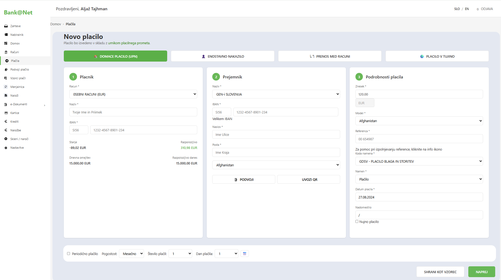
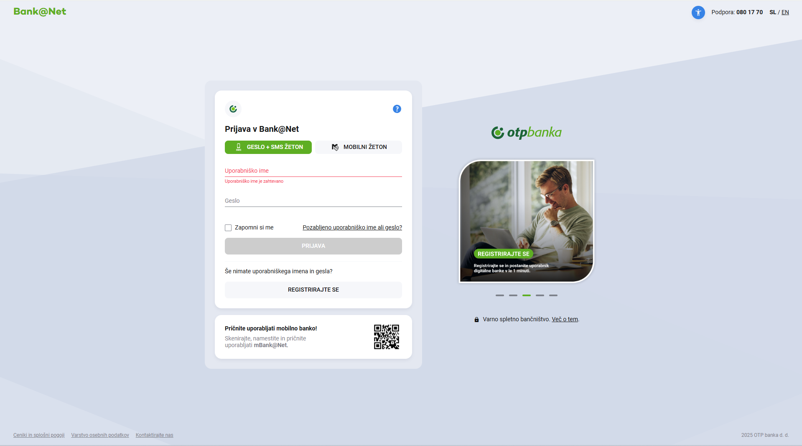
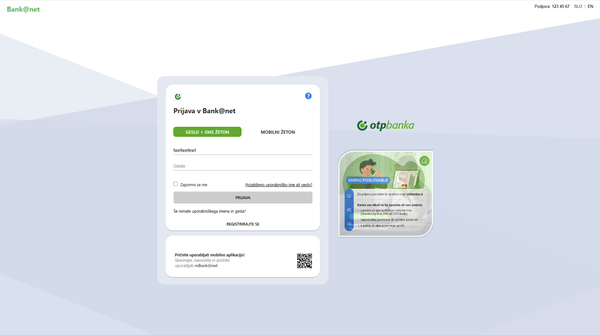

# Bank@net kopija

**Bank@net** je preprosta spletna stran, ki omogoča uporabnikom izpolnjevanje obrazcev z različnimi vrstami vnosnih polj. Ta projekt je zasnovan tako, da zagotavlja enostavno in hitro izkušnjo za uporabnike, ki potrebujejo spletne obrazce za različne namene.

## Pregled

Na tej spletni strani lahko uporabniki izpolnijo obrazec, ki omogoča vnos različnih podatkov. Oblika spletnega obrazca vključuje več vrst vnosnih polj, kot so besedilna polja, potrditvena polja, gumbi za izbiro in podobno. Spletna stran omogoča tudi osnovno validacijo podatkov in je oblikovana tako, da je uporabniku prijazna in enostavna za uporabo.

## Funkcionalnosti

- **Enostaven obrazec** za vnos različnih podatkov.
- **Validacija vnosov** za zagotovitev pravilnosti podatkov.
- **Interaktivna spletna stran**, ki uporabniku omogoča takojšnjo povratno informacijo o napakah pri vnosu.
- **Uporabniku prijazna zasnova**, ki omogoča hitro in enostavno izpolnjevanje obrazca.

## Tehnologije

Ta projekt je bil ustvarjen z uporabo naslednjih tehnologij:

- **HTML**: Struktura in vsebina spletne strani.
- **CSS**: Oblikovanje in postavitev spletne strani.
- **JavaScript**: Skripting za interaktivnost, validacijo obrazcev in ostale dinamične funkcionalnosti.

## Povezava do spletne strani

Projekt je gostovan na GitHub Pages. Spletno stran lahko obiščete tukaj:

[https://belingar.github.io/obrazec/](https://belingar.github.io/obrazec/)

## Začetek

Če želite zagnati projekt lokalno na svojem računalniku, sledite tem preprostim korakom:

### 1. Klonirajte repozitorij
Najprej klonirajte repozitorij na svoj računalnik z uporabo naslednjega ukaza:

```bash
git clone https://github.com/belingar/obrazec.git
```

### 2. Odprite datoteko `obrazec.html`
Za zagon obrazca preprosto odprite datoteko `obrazec.html` v katerem koli brskalniku. Spletna stran bo delovala brez potrebe po lokalnem strežniku.

### 3. Uporaba
Izpolnite polja v obrazcu in preverite, če so vsi podatki pravilno vneseni. Obrazec bo samodejno opozoril na napačne vnose.

### 4. Origina in kopija
Izpovnjevanje obrazca

Kopija ipovnjevanja obrazca


Prijava v obrazec

Kopija prijave v obrazec


## Avtorji

Urh Belingar

## Licenca

Ta projekt je licenciran pod MIT License – podrobnosti so na voljo v datoteki LICENSE.

